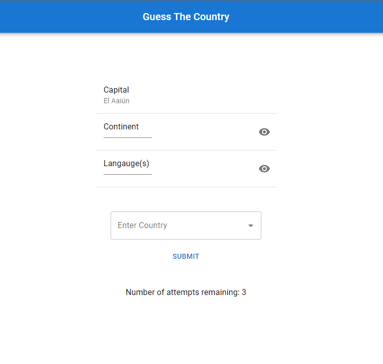

# Guess the Country Game w/React + TypeScript + Vite

This is a simple front-end project, or trivia game, where the purpose of the game is for the user to guess a certain country in question.

# Demo Link:

TBD

# Game Rules:

- User is given 3 attempts to guess the country
- The first hint (capital) is given to the user
- The user has the option to reveal 2 additional hints, each at a cost of an attempt

# This project was developed using:

- Vite (Front-end tooling and project scaffold)
- React + TypeScript
- HTML, CSS, JS
- GraphQL + Apollo/Client
- Material UI 5 (styling)
- React Hook Form (form management)

# Setup

- download or clone the repo
- run `npm install` in the root
- run `npm run dev` to run on local
- go to http://localhost:5173/ in the browser

# Status

Guess the country is still in progress. This first version was developed quickly and the plan (so far) is to implement the following updates:

- Many additional UI featurs (dark mode, menu, etc...)
- Additional game features (keeping score etc...)
- Storybook (for UI development)
- Jest ( unit testing)
- Implement global state management using useContext and remove existing prop drilling
- Deploy to AWS for live demo

# License

Project is published under the MIT license.
